# tour-creator

* [Установка](#установка)  
* [Понятия](#понятия)  
* [Интерфейс](#интерфейс)  
* [Сборка и экспорт](#сборка-и-экспорт)  

## Установка

Склонируйте этот репозиторий в папку `Packages`. 

Для тех, кто захочет что-нибудь менять в плагине, можно добавить его в `Packages` как **git submodule**.

## Понятия

**Экскурсия** (тур) состоит из нескольких состояний и связей между ними. В проекте **Unity** одна экскурсия - одна сцена. Причём на сцене обязательно должен быть объект зрителя.

**Состояние** представляет какую-то локацию, на которой каким-либо образом будет преподнесён контент. В один момент времени зритель может находится только в одном состоянии либо переходить между двумя. На сцене в качестве состояний используются **prefab**'ы, содержащие нужные компоненты с данными. В редакторе они отображаются реальными сферами на сцене, но в итоговой сборке в угоду производительности они никак не рисуются, а лишь предоставляют информацию объекту зрителя.

**Связь** - переход между двумя состояниями. Связь однонаправленная, но по умолчанию для двух состояний создаются две связи противоположных направлений. У начала и конца связи есть физическое представление, выраженное в виде маркера.

## Интерфейс

> После установки сверху должен появиться пункт меню **Tour Creator**, если вдруг его там нет, то проверьте правильность установки или наличие ошибок в консоли.

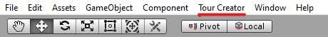

Для создания новой экскурсии нажмите **Tour Creator > New Tour**. Это создаст почти пустую сцену с одним лишь объектом зрителя. Лучше использовать именно такой способ, а не перетаскивать его **prefab** вручную, т.к. впоследствии может появится специфичная логика настройки сцены.

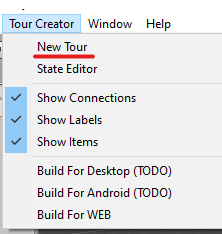

Откройте основной инструмент для экскурсий с помощью **Tour Creator > State Editor** 

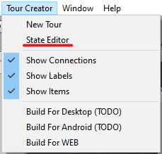

и закрепите его куда-нибудь в удобное место. **Create new state** создаст на сцене новое пустое состояние. 

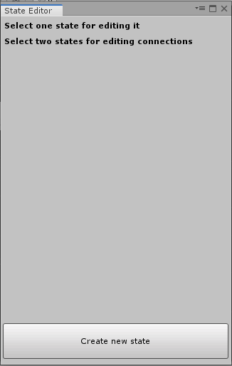

> Всегда создавайте новые состояния только через **State Editor**! Никогда не копируйте уже созданные состояния, если на них уже есть какие-либо связи!

У состояния есть некоторые параметры. Выберите только что созданное состояние и они появятся в **State Editor**. 

**State title** - название. Оно будет отображаться на маркере и оно будет являтся названием объекта в иерархии сцены. У разных состояний могут быть одинаковые названия.

**Panorama** - группа полей, для работы с панорамой:
* **Script: FileImageSource** - показывает, что в проекте будет использоваться обычный файл картинки с панорамой. 
* **Texsture** - сюда надо импортировать сам файл, который будет использоваться в качестве текстуры на данном состояние. При экспорте экскурсии файл тоже будет экспортирован.

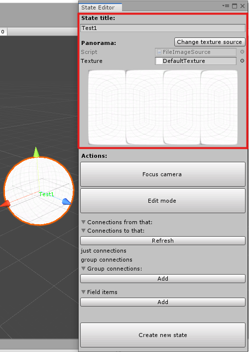

> Для отображения используется [equirectangular projection (равнопромежуточная проекция)](https://ru.wikipedia.org/wiki/%D0%A0%D0%B0%D0%B2%D0%BD%D0%BE%D0%BF%D1%80%D0%BE%D0%BC%D0%B5%D0%B6%D1%83%D1%82%D0%BE%D1%87%D0%BD%D0%B0%D1%8F_%D0%BF%D1%80%D0%BE%D0%B5%D0%BA%D1%86%D0%B8%D1%8F)

> При подборе панорам надо искать компромиссы между их разрешением и весом итоговой сборки. Минимально приемлемым разрешением является **2048 x 1024**, но всё зависит от целевой платформы

Создайте ещё одно состояние и выделите его вместе с предыдущим. В **State Editor** нажмите **Toggle connection** чтобы создать или удалить (если она уже была) связь между двумя состояниями. 

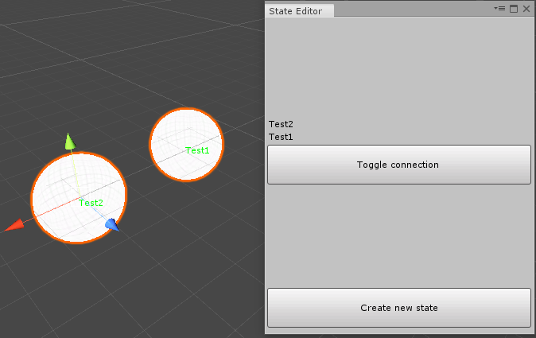

После этого выделите какое-нибудь одно состояние.

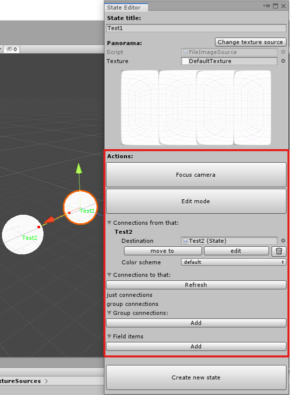

**Actions** - настройка и просмотр данного состояния:

* **Focus camera** -  кнопка переместит камеру внутрь панорамы. Выйти из него можно с помощью колесика мыши.
* **Edit mode** - кнопка включает режим редактирования. Отключает всю лишнюю информацию, оставляя только ту, что относится к данному состоянию. Выключается повторным нажатием.
* **Connections from that** - список состояний, на которые ссылается данное состояние:
  * **Destination** - указывается состояние, с которым установлена связь.
  * **move to** - кнопка для перехода к этому состоянию
  * **edit** - кнопка позвояет перейти в режим редактирования связей. С помощью ЛКМ указывается место, где должен располагаться переход. Выключается режим повторным нажатием.
  * **Color scheme** - цвет модели перехода. Чтобы поменять цвет перехода нужно зайти в описание компонента **Tour** объекта с названием `ViewSphere`. В пункте **Color Schemes** указать нужный цвет с помощью "пипетки".  
   
* **Connections to that** - позволяет указать угол, на который будет повёрнута камера, при переходе в указанное состояние. Требуется нажать на кнопку **Refresh**, чтобы появился список. 
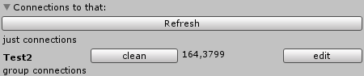  
  * **edit** - по нажатию на данную кнопу запускается режим редактирования, где настраивается угол поворота камеры. Угол меняется при нажатие ЛКМ на стенку состояния. Выключается повторным нажатием.
  * **clean** - возвращение в исходное положение.
* **Group connections** - список групповых связей. Позволяет через одну точку переходить в разные состояния, с помощью списка.    
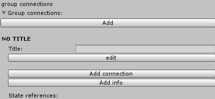  
  * **Add** - создаёт новый групповой переход.
  * **Title** - название перехода.
  * **edit** - кнопка позвояет перейти в режим редактирования связей. С помощью ЛКМ указывается место, где должен располагаться переход. Выключается режим повторным нажатием. 
  * **Add connetion** - кнопка для добавление существующей связи к групповой. Предлагается выбрать состояние из списка, которое уже присоединено к текущему через **Toggle connection**.
  * **Add info** - кнопка для добавления дополнительной информации, которая будет выводиться под кнопками группового перехода.

Для включения или выключения отображения связей используйте пункт меню **Tour Creator > Show Connections** или **Tour Creator > Show Labels** для названий.

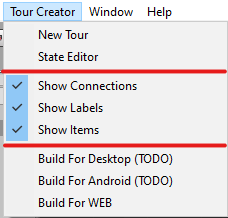 

## Сборка и экспорт

После того, как будут созданы и заполнены все нужные состояния со всеми нужными переходами, можно перейти к этапу сборки или экспорта.

Для начала надо указать исходное состояние у объекта зрителя. Перетащите из дерева сцены нужное состояние в поле **First State** компонента **Tour** объекта с названием `ViewSphere`. Также можно настроить скорость перехода.

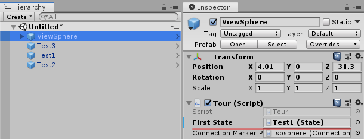 

Пройдитесь по всем использованным в проекте текстурам и выберите оптимальный метод сжатия для сокращения размера итоговой сборки. 

Есть возможность добавить логотип внутрь анимации загрузки при переходах между состояниями. Для этого нужно указать требуемый логотип в поле **Logo Texture** в `ViewSphere`.

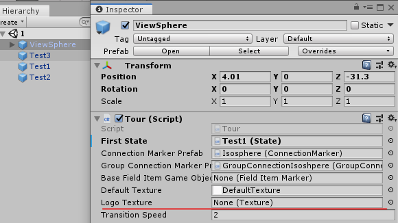 

Из коробки в плагине доступен билд только под Web. Для этого используйте пункт меню **Tour Creator > Build For Web**.

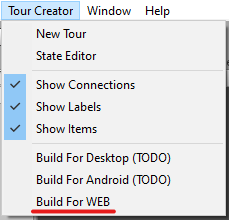 

Далее открывается окно `Web build manager`. 

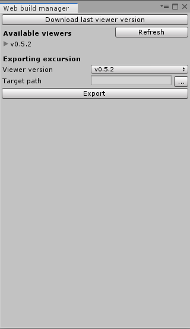 

Чтобы скачать последнюю версию сборщика, нажмите на кнопку **Download last viewer version**. В поле **Target path** указывается папка, куда будет собран проект.   
Для начала процесса сборки нажмите на кнопку **Export**.